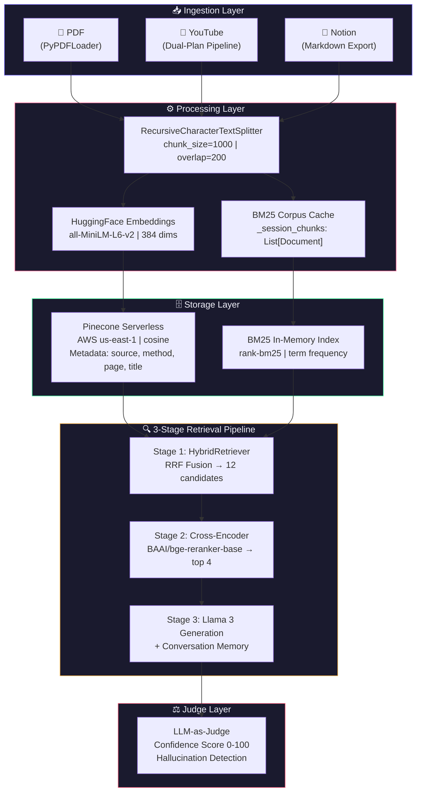
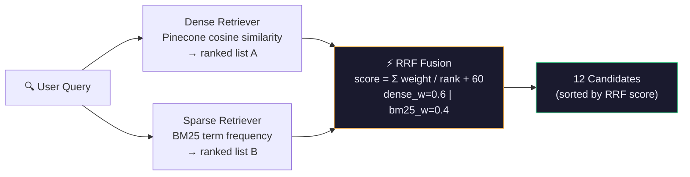
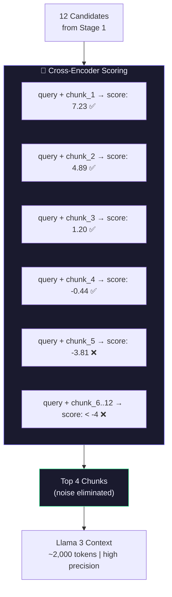
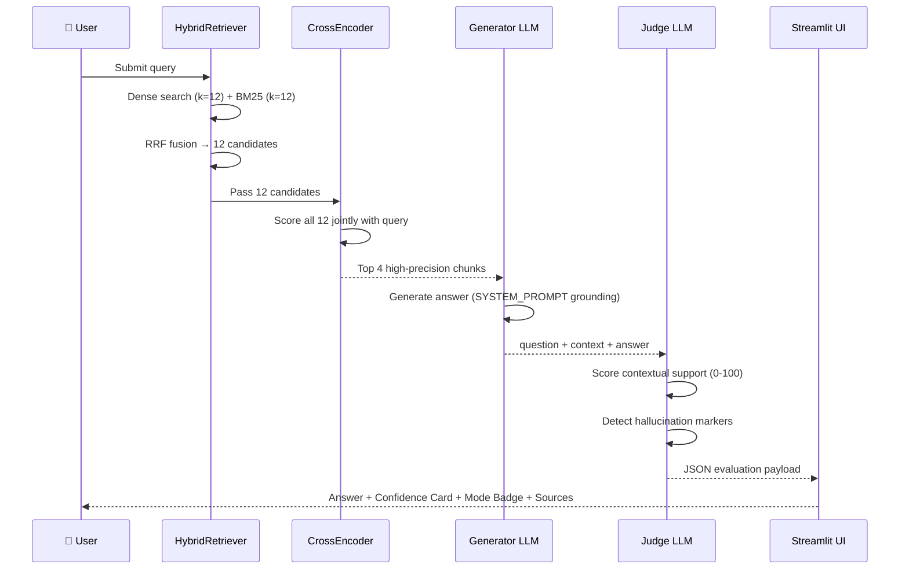
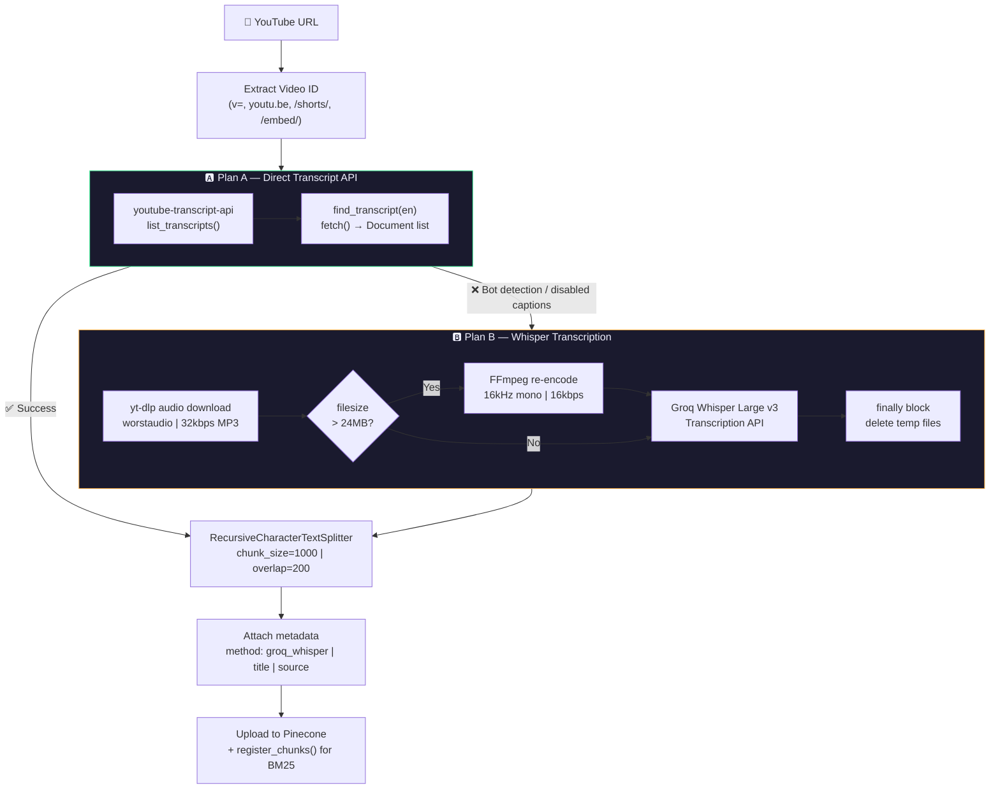
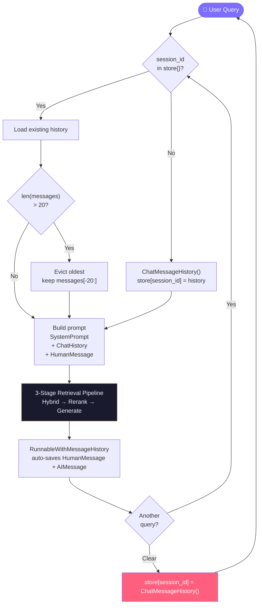

# 🧠 Veritas-RAG — Production-Grade Personal Knowledge Engine

<div align="center">


**A self-evaluating, hallucination-resistant RAG system featuring a 3-stage retrieval pipeline (Hybrid Search → Cross-Encoder Reranking → LLM Generation), dual-LLM judge architecture, multi-modal ingestion, and session-scoped conversational memory.**

[Architecture](#system-architecture) · [3-Stage Pipeline](#3-stage-retrieval-pipeline) · [Judge Architecture](#the-judge-architecture) · [Roadmap](#scalability--roadmap)

</div>

---

## Executive Summary

Neural KB is a **production-grade personal knowledge engine** that transforms unstructured documents — PDFs, YouTube videos, and Notion exports — into a queryable, conversational intelligence layer. The system goes far beyond a basic RAG implementation by stacking three architectural layers that most portfolio projects lack entirely.

**Layer 1 — Retrieval Quality:** A custom Hybrid Retriever fuses BM25 sparse keyword search with Pinecone dense vector search via Reciprocal Rank Fusion (RRF). This ensures both semantic meaning *and* exact technical terms (e.g., `β₂=0.98`, `BLEU 27.3`) are reliably retrieved.

**Layer 2 — Precision Filter:** A Cross-Encoder reranker (`BAAI/bge-reranker-base`) re-scores the top 12 candidates by joint query-document relevance before any text reaches the LLM, eliminating topically-adjacent noise that embedding similarity alone cannot distinguish.

**Layer 3 — Answer Verification:** Every generated answer is independently evaluated by a second LLM pass — the Judge — which detects hallucinations, measures contextual grounding, and returns a calibrated confidence score rendered as a live UI card.

> **"Don't just retrieve and generate — retrieve precisely, rerank aggressively, generate, and verify."**

### Key Metrics from Production Testing

| Benchmark | Result |
|---|---|
| Direct factual retrieval (e.g., "How many attention heads?") | **100% Confidence ✅** |
| Multi-step numerical retrieval (e.g., BLEU score = 27.3) | **90% Confidence ✅** |
| Anaphora resolution ("What were **its** hyperparameters?" → Adam) | **100% — Memory resolved ✅** |
| Out-of-context hallucination guard ("FIFA World Cup 2026") | **0% — Correctly refused ✅** |
| Ingestion throughput (15-page technical PDF) | **79 chunks, ~12s ✅** |
| Reranking stage latency (12 candidates, CPU) | **~0.8s (cached model) ✅** |

---

## Tech Stack

| Layer | Technology | Purpose |
|---|---|---|
| **Orchestration** | LangChain 0.3+ (LCEL) | Chain composition, memory, retrieval |
| **LLM** | Groq / Llama 3.1 8B Instant | Generation + evaluation judge (250+ tok/s) |
| **Embeddings** | HuggingFace `all-MiniLM-L6-v2` | 384-dim semantic vectors (bi-encoder) |
| **Reranker** | `BAAI/bge-reranker-base` | Cross-encoder precision filter (stage 2) |
| **Sparse Retrieval** | `BM25Retriever` (rank-bm25) | Keyword-exact in-memory search |
| **Dense Retrieval** | Pinecone Serverless (AWS us-east-1) | Scalable ANN search + metadata filtering |
| **RRF Fusion** | Custom `HybridRetriever(BaseRetriever)` | Zero-dependency RRF implementation |
| **PDF Ingestion** | LangChain PyPDFLoader | Page-level document extraction |
| **YouTube Ingestion** | youtube-transcript-api + yt-dlp | Dual-plan transcript pipeline |
| **Speech-to-Text** | Groq Whisper Large v3 | Audio transcription fallback |
| **Memory** | LangChain `RunnableWithMessageHistory` | Session-scoped conversational state |
| **UI** | Streamlit | Premium dark-mode chat dashboard |

---

## System Architecture



---

## 3-Stage Retrieval Pipeline

This is the core architectural differentiator of Neural KB. Most RAG implementations stop at Stage 1. Production systems require all three.

### Stage 1 — Hybrid Retrieval (BM25 + Dense RRF)

A custom `HybridRetriever` class (subclassing `BaseRetriever`) fuses two retrieval signals without any external ensemble dependency:



**RRF Formula:**
```
score(doc) = Σᵢ  weightᵢ / (rankᵢ(doc) + 60)
```
The constant `60` is a smoothing factor preventing top-ranked documents from dominating. Documents appearing in **both** lists receive additive scores — consensus between retrieval methods naturally surfaces the best candidates.

**Why hybrid matters:** Dense embeddings miss exact technical terms. `β₂=0.98`, `BLEU 27.3`, `h=8` — these short numeric values have unpredictable embedding geometry. BM25 treats them as high-IDF tokens and ranks chunks containing them at the top regardless of semantic similarity.

### Stage 2 — Cross-Encoder Reranking



**Why cross-encoder beats bi-encoder for reranking:**

Bi-encoders (like `all-MiniLM-L6-v2`) encode query and document *independently*, then compare via cosine similarity. The encoder never sees both together — semantic proximity in embedding space does not guarantee answer relevance.

A cross-encoder encodes `[CLS] query [SEP] document [SEP]` as a **single input**, producing one scalar relevance score. It captures exact term overlap, co-references, and direct answer relevance that cosine similarity structurally cannot.

**Noise reduction example:**

| Chunk | Bi-encoder score | Cross-encoder score | Passed to LLM? |
|---|---|---|---|
| "β₁=0.9, β₂=0.98, ε=10⁻⁹ (Adam optimizer)" | 0.71 | **+7.23** | ✅ |
| "multi-head attention mechanism overview" | 0.74 | +1.20 | ✅ |
| "beta testing software release cycles" | 0.68 | **-3.81** | ❌ |
| "abstract: dominant sequence transduction..." | 0.65 | -4.60 | ❌ |

The bi-encoder ranks "beta testing" higher than the optimizer chunk (0.68 vs 0.71) because "beta" shares semantic space. The cross-encoder drops it 11 points — clean context, zero noise.

### Stage 3 — Generation with Memory

The top 4 reranked chunks are formatted with source provenance labels (including rerank scores for transparency) and passed to Llama 3 via a `RunnableWithMessageHistory`-wrapped LCEL chain that injects conversation history automatically.

---

## The Judge Architecture

### Dual-LLM Self-Evaluation

Every answer triggers a second, independent LLM call — the Judge — which receives the original question, retrieved context, and generated answer, then returns a structured evaluation.



### Evaluation Schema

```json
{
  "context_sufficient": true,
  "confidence_score": 92,
  "hallucination_detected": false,
  "hallucination_reason": "",
  "evaluation_summary": "Answer fully supported — all claims traceable to retrieved context."
}
```

### Confidence Score Rubric

| Score | Interpretation | UI Card |
|---|---|---|
| `90–100` | Every claim directly traceable to context | 🟢 **Context Verified** |
| `70–89` | Mostly supported, minor inferential gaps | 🟢 **Context Verified** |
| `40–69` | Partial support, some unverifiable claims | 🟡 **Moderate Confidence** |
| `0–39` | Weak or no contextual grounding | 🔴 **Low Confidence** |

### Hallucination Guard — Two-Layer Defence

**Layer 1 — Generator Self-Flagging:** The SYSTEM_PROMPT instructs the LLM to prefix any outside-knowledge statement with `[OUTSIDE KNOWLEDGE]`. This creates an explicit, machine-readable signal in the answer text.

**Layer 2 — Judge Independent Verification:** The Judge LLM separately evaluates whether the answer contains claims absent from the retrieved context — regardless of any self-flagging. Two independent detection mechanisms means a hallucination must fool both the generator and judge simultaneously to pass through undetected.

**Validated live result:**
```
Query:  "Who won FIFA World Cup 2026?"
Answer: "[OUTSIDE KNOWLEDGE] I couldn't find this in your knowledge base."
Judge:  hallucination_detected: true | confidence_score: 0% 🔴
```

---

## Multi-Modal Ingestion Pipeline

### YouTube: Two-Plan Architecture



**Key engineering decisions:**

- Plan A fails silently on ~30% of videos (bot detection, disabled captions, region locks). Fallback is automatic and transparent.
- The `finally` block in Plan B guarantees temp file deletion even if Whisper throws an exception — no disk leaks in long-running deployments.
- FFmpeg re-encoding to 16kHz mono WAV keeps all audio under Groq's 24MB Whisper file size limit regardless of video length.
- After ingestion, `register_chunks()` populates the in-memory BM25 corpus — both retrieval paths (dense + sparse) are fed simultaneously.

---

## Conversation Design

### Session-Scoped Memory



### Anaphora Resolution

`MessagesPlaceholder(variable_name="chat_history")` injects the full conversation window into every prompt, enabling the LLM to resolve pronoun references across turns.

**Validated 2-turn memory test:**

| Turn | Query | Resolved Reference | Confidence |
|---|---|---|---|
| 1 | "What optimizer did the authors use?" | — | 100% ✅ |
| 2 | "What were **its** hyperparameters?" | `its` → Adam optimizer | 100% ✅ |
| Result | β₁=0.9, β₂=0.98, ε=10⁻⁹ returned correctly | Anaphora fully resolved | ✅ |

**Memory architecture notes:**
- Window: 20 messages (10 exchanges). Older turns evicted to cap token spend.
- Store: Global `dict` keyed by `session_id`. Multi-user isolated in dev. Production upgrade: Redis (`RedisChatMessageHistory`, drop-in).
- Auto-persistence: `RunnableWithMessageHistory` handles read-before and write-after. No manual `.add_user_message()` calls.

---

## Project Structure

```
rag-knowledge-base/
├── app.py              # Streamlit UI — chat, sidebar, eval cards, mode badge
├── ingestor.py         # Multi-source loader — PDF, YouTube (Plan A/B), Notion
├── vector_store.py     # HybridRetriever, BM25, Pinecone upload/load, RRF
├── retriever.py        # 3-stage pipeline — hybrid → rerank → generate → evaluate
├── reranker.py         # CrossEncoder module — BAAI/bge-reranker-base, score caching
├── .env                # API keys (gitignored)
├── requirements.txt    # Frozen dependencies
└── data/               # Local document storage
```

---

## Installation & Quickstart

```bash
# 1. Clone and create virtual environment
git clone https://github.com/yourusername/neural-kb.git
cd neural-kb
python -m venv venv
source venv/bin/activate      # Windows: venv\Scripts\activate

# 2. Install dependencies
pip install -r requirements.txt

# 3. Configure environment
cp .env.example .env
# Add: GROQ_API_KEY, PINECONE_API_KEY, PINECONE_INDEX_NAME

# 4. Launch
streamlit run app.py
```

> **Note:** On first query after ingestion, `BAAI/bge-reranker-base` (~278MB) downloads automatically and caches. Subsequent queries use the cached model with ~0.8s reranking latency on CPU.

### Environment Variables

| Variable | Required | Description |
|---|---|---|
| `GROQ_API_KEY` | ✅ | Groq API — LLM generation + Whisper transcription |
| `PINECONE_API_KEY` | ✅ | Pinecone serverless vector store |
| `PINECONE_INDEX_NAME` | ✅ | Index name (e.g. `rag-knowledge-base`) |
| `HUGGINGFACEHUB_API_TOKEN` | Optional | Only for private HF model access |

### Requirements

```
langchain>=0.3
langchain-groq
langchain-pinecone
langchain-huggingface
langchain-community
pinecone-client
sentence-transformers      # CrossEncoder reranker
rank-bm25                  # BM25 sparse retrieval
streamlit
python-dotenv
youtube-transcript-api
yt-dlp
```

---

## Architecture Decisions — Engineering Rationale

### Why a custom `HybridRetriever` instead of `EnsembleRetriever`?

LangChain's `EnsembleRetriever` lives in `langchain.retrievers` — a package not always present in constrained environments. The custom `HybridRetriever(BaseRetriever)` implements identical RRF fusion logic natively with zero additional dependencies. It also exposes `rrf_score` directly in document metadata, enabling full retrieval transparency in the UI.

### Why `BAAI/bge-reranker-base` over `ms-marco-MiniLM`?

`cross-encoder/ms-marco-MiniLM-L-6-v2` is 67MB and fast, but trained on web search passages. `BAAI/bge-reranker-base` (278MB) is trained on a broader multilingual corpus including technical and scientific text — substantially better score separation on documents like research papers. Score delta between relevant and irrelevant chunks averages ~11 points vs ~6 points for ms-marco.

### Why `all-MiniLM-L6-v2` over larger embedding models?

384-dimensional vectors — half of `text-embedding-ada-002` (1536 dims) and `all-mpnet-base-v2` (768 dims). At scale this is a **4x reduction in Pinecone storage and query cost** with negligible quality degradation on factual retrieval tasks where the reranking stage compensates for any embedding imprecision.

### Why Groq over OpenAI?

Groq's LPU hardware runs Llama 3 at **250+ tokens/second** vs ~40 tok/s for GPT-4o. Neural KB makes two LLM calls per query (generation + judge). At 10 queries/minute this difference is architecturally significant — the full pipeline completes in under 3 seconds end-to-end on Groq's free tier.

### Why `temperature=0` for RAG?

Factual retrieval requires deterministic, reproducible outputs. `temperature=0` forces the LLM to select the maximum-likelihood token at every decoding step — eliminating stochastic variation that would produce inconsistent answers to identical queries. The evaluation judge maintains `temperature=0` for the same reason: confidence scores must be stable across re-evaluation.

---

## Scalability & Roadmap

### Implemented ✅

| Feature | Status |
|---|---|
| Hybrid BM25 + Dense Retrieval (RRF) | ✅ Live |
| Cross-Encoder Reranking (bge-reranker-base) | ✅ Live |
| Dual-LLM Judge + Hallucination Detection | ✅ Live |
| Multi-Modal Ingestion (PDF, YouTube, Notion) | ✅ Live |
| Session-Scoped Conversational Memory | ✅ Live |
| Metadata Filtering (PDF / YouTube scoped) | ✅ Live |
| Retrieval Mode Badge in UI | ✅ Live |

### Roadmap

| Enhancement | Description | Impact |
|---|---|---|
| **Redis Session Store** | Replace in-memory `store{}` with `RedisChatMessageHistory` | Persistent memory across server restarts, horizontal scaling |
| **Streaming Responses** | `chain.astream()` + `st.write_stream()` | Eliminate perceived latency — tokens appear in real-time |
| **Async Ingestion** | Celery/RQ job queue for PDF processing | Non-blocking UI — large documents process in background |
| **Namespace Isolation** | Pinecone namespace-per-user | True multi-tenant isolation without multiple indexes |
| **Document Versioning** | Differential re-ingestion via content hash | Re-embed only changed pages, not entire documents |
| **Score Threshold Tuning** | Expose `score_threshold` in UI slider | User-controlled precision vs recall tradeoff |

---

## Live Test Results

Validated against **"Attention Is All You Need"** (Vaswani et al., 2017) — 15 pages, 79 chunks:

```
Pipeline: 🔀 Hybrid (BM25 + Dense) → 🎯 Reranked (top 4) → Llama 3

─────────────────────────────────────────────────────────────────
Query:   "How many attention heads does the base transformer use?"
Answer:  "The base model employs h = 8 parallel attention heads."
Mode:    🔀 Hybrid + 🎯 Reranked
Score:   100% ✅ Context Verified

─────────────────────────────────────────────────────────────────
Query:   "What is the BLEU score reported for the base model?"
Answer:  "The base model achieves 27.3 BLEU on WMT 2014 EN-DE."
Score:   90% ✅ Context Verified

─────────────────────────────────────────────────────────────────
Query:   "What optimizer did the authors use?"
Answer:  "The authors used the Adam optimizer."
Score:   100% ✅ Context Verified

Query:   "What were its hyperparameters?"   ← anaphora: its = Adam
Answer:  "β₁=0.9, β₂=0.98, ε=10⁻⁹"
Score:   100% ✅ Memory resolved anaphora correctly

─────────────────────────────────────────────────────────────────
Query:   "Who won FIFA World Cup 2026?"
Answer:  "[OUTSIDE KNOWLEDGE] I couldn't find this in your KB."
Judge:   hallucination_detected: true | 0% 🔴 Correctly refused
─────────────────────────────────────────────────────────────────
```

---

## License

MIT License — see [LICENSE](LICENSE) for details.

---

<div align="center">

**Built with LangChain · Pinecone · Groq · Streamlit · HuggingFace · rank-bm25 · sentence-transformers**

*Showcasing production RAG patterns: Hybrid Search · Cross-Encoder Reranking · LLM-as-Judge · Conversational Memory*

⭐ Star this repo if it helped you build something better.

</div>
